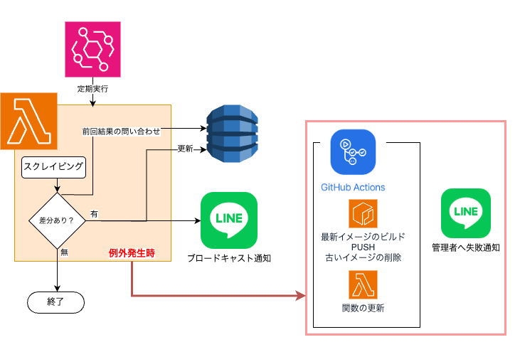

# Web定期監視 × LINE通知システム（Serverless × AWS）
---

## 📌 概要
指定したWebサイトの内容に変更があった場合、自動でLINEに通知するサーバーレスシステムです。  
AWS LambdaとEventBridgeを使い、定期的にスクレイピング＆変更検知を行っています。

---

## 🛠️ 使用技術・構成

| サービス       | 役割                             |
|----------------|----------------------------------|
| Amazon EventBridge | 定期的なトリガー（スケジューラ）     |
| AWS Lambda     | スクレイピング / 差分チェック / 通知 |
| Amazon DynamoDB| データ保持                 |
| LINE Messaging API | 通知送信先（外部サービス）         |
| Github Action | イメージのプッシュ、ラムダの更新         |


構成図：



---

### 🔁 通常フロー（成功時）

1. **Amazon EventBridge** が定期的に Lambda 関数を実行  
2. Lambda が対象の Web サイトをスクレイピング  
3. **DynamoDB** に保存された前回のデータと比較  
4. データに差分があれば  
   - DynamoDB を更新  
   - **LINE API を通じて参加者へブロードキャスト通知**


### ❌ エラーフロー（主に ChromeDriver のバージョン不一致）

1. Lambda 内で例外が発生した場合、**管理者LINE通知**を送信  
2. さらに **GitHub Actions の `repository_dispatch` イベントをトリガー**  
3. GitHub Actions 側で以下を実行：  
   - `umihico/docker-selenium-lambda` をベースにした **最新 ChromeDriver イメージの再ビルド**  
   - **Amazon ECR** へのプッシュ  
   - **Lambda 関数のイメージ更新**  
   - **古い ECR イメージのクリーンアップ**

---

## 💡 特徴
- 完全サーバーレス構成でインフラレスな運用
- LINE通知でリアルタイムな変化検知が可能
- 構成がシンプルで、別用途にも流用しやすい
- seleniumを使っているため定期的なブラウザ実行などにも使用可能

---

# 🚀 ローカル開発手順（LocalStack + DynamoDB + Selenium）

## ✅ 前提条件

- Python 3.11+
- Docker / Docker Compose
- Google Chrome（インストール済み）
- 仮想環境（venv など）

---

### 📦 1. 依存ライブラリインストール

```bash
python3 -m venv venv
source venv/bin/activate  # Windows: venv\Scripts\activate
pip3 install -r dev-requirements.txt
```

### 🐳 2. Docker で LocalStack 起動
```bash
docker-compose up -d
```
docker-compose.yml により、LocalStack（DynamoDB）と以下の初期データがLocalStack 上に作成されます。

テーブル名: 

    scraping_data

初期データ:

    data_id: penelope
    title: タイトル
    page_url: ページURL

### 🧪 3. ローカルでスクレイピング実行
```bash
python3 src/local_run.py
```
このスクリプト内で環境変数が設定され、LocalStack 上の DynamoDB に接続して動作します。

### 🌐 DynamoDB GUI の確認（任意）

ブラウザで DynamoDB の管理ツールにアクセスするには、以下のリンクをクリックしてください：

[http://localhost:8001](http://localhost:8001)

これにより、DynamoDB のデータをブラウザ上で確認・操作できます。

# 🔌 終了手順

開発環境を終了するには、以下のコマンドを実行します：

```bash
deactivate
docker-compose down -v
```
