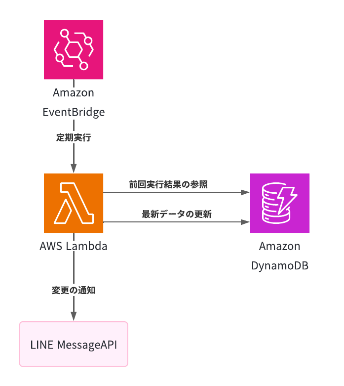

# Web監視 × LINE通知システム（Serverless × AWS）
---

## 📌 概要
指定したWebサイトの内容に変更があった場合、自動でLINEに通知するサーバーレスシステムです。  
AWS LambdaとEventBridgeを使い、定期的にスクレイピング＆変更検知を行っています。

---

## 🛠️ 使用技術・構成

| サービス       | 役割                             |
|----------------|----------------------------------|
| Amazon EventBridge | 定期的なトリガー（スケジューラ）     |
| AWS Lambda     | スクレイピング / 差分チェック / 通知 |
| Amazon DynamoDB| データ保持                 |
| LINE Messaging API | 通知送信先（外部サービス）         |

構成図：

## 🔁 処理フロー

1. EventBridgeが定期的にLambdaを起動
2. Lambdaが対象Webサイトをスクレイピング
3. DynamoDBに保存された前回データと比較
4. 変更があればLINE APIを通じて通知

---

## 💡 特徴
- 完全サーバーレス構成でインフラレスな運用
- LINE通知でリアルタイムな変化検知が可能
- 構成がシンプルで、別用途にも流用しやすい

https://github.com/umihico/docker-selenium-lambda